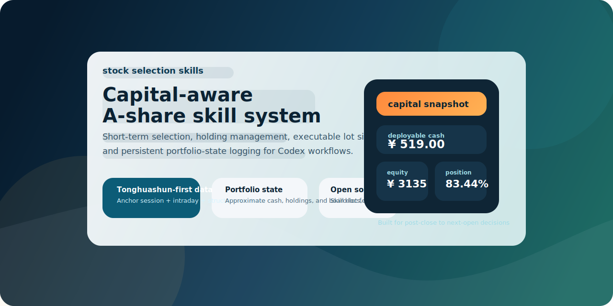
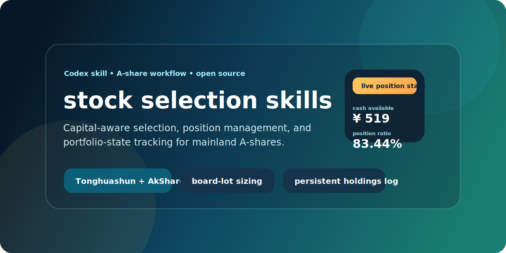
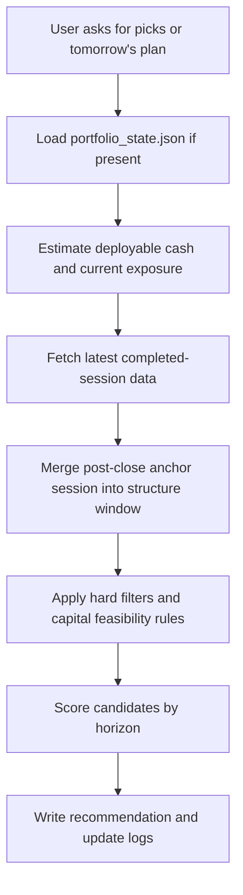

<div align="center">



# stock selection skills

Capital-aware A-share stock selection and position-management skill for Codex.

Built for the post-close to next-open window, with executable board-lot checks, structure-based plans, and persistent portfolio-state logging.

<p>
  
  
  
  
  
</p>

<p>
  <a href="https://github.com/3109406559-code/stock-selection-skills">Repository</a> •
  <a href="./SKILL.md">Skill Spec</a> •
  <a href="./references/capital-and-position-management.md">Capital Rules</a> •
  <a href="./scripts/smoke_test.py">Smoke Test</a>
</p>

</div>

## Snapshot

| Area | What it gives you |
|---|---|
| Selection | Short-term, medium-term, and long-term A-share workflows in one skill |
| Execution | Board-lot feasibility checks before pretending a trade is actually buyable |
| Tracking | Persistent `portfolio_state.json` for approximate cash, holdings, and exposure |
| Data | Tonghuashun-first machine-readable anchors, with AkShare enrichment when available |
| Validation | Script-backed smoke test and GitHub Actions validation |

## Visual Preview

<div align="center">
  
</div>

Ready-to-upload preview files:

- `assets/social-preview.png`
- `assets/social-preview.svg`

If you want to set a custom GitHub social preview image, upload `assets/social-preview.png` from the GitHub repository settings page.

## Why This Repo Exists

Most stock-picking prompts stop at "what looks strong." This skill pushes one step further:

- it checks whether the user can actually afford one board lot
- it carries forward approximate capital and holdings state between conversations
- it separates existing-position management from fresh watchlist ideas
- it uses a script-backed path instead of relying only on prompt memory

That makes it much more useful for small-account A-share workflows.

## How It Works



## Highlights

- Capital-aware board-lot feasibility checks before recommending executable trades
- Persistent portfolio-state logging under `股票日志/portfolio_state.json`
- Short-term, medium-term, and long-term A-share workflows in one skill
- Tonghuashun machine-readable anchors plus AkShare cross-checks when available
- Post-close structure handling that merges the just-finished session into the decision window
- Script-backed flow rather than prompt-only heuristics

## Repository Layout

```text
stock-selection-skills/
|- SKILL.md
|- agents/
|  |- openai.yaml
|- assets/
|  |- github-hero.svg
|  |- social-preview.svg
|- references/
|  |- capital-and-position-management.md
|  |- data-sources-and-window.md
|  |- horizon-selection-framework.md
|  |- output-template.md
|  |- price-plan-rules.md
|  |- short-term-backtest-workflow.md
|  |- trading-window-and-calendar.md
|  |- universe-and-risk-filters.md
|- scripts/
|  |- backtest_short_term_rule.py
|  |- fetch_a_share_data.py
|  |- portfolio_state.py
|  |- requirements.txt
|  |- smoke_test.py
|- .github/
|  |- release.yml
|  |- workflows/
|     |- ci.yml
|- LICENSE
`- README.md
```

## Quick Start

### 1. Install dependencies

```powershell
python -m venv .venv
.venv\Scripts\python.exe -m pip install -r scripts\requirements.txt
```

### 2. Run the smoke test

```powershell
.venv\Scripts\python.exe scripts\smoke_test.py
```

### 3. Fetch one stock

```powershell
.venv\Scripts\python.exe scripts\fetch_a_share_data.py 000862 --days 120 --include-intraday --pretty
```

### 4. Initialize an approximate portfolio state

```powershell
.venv\Scripts\python.exe scripts\portfolio_state.py init --cash 3000 --as-of-date 2026-03-23 --overwrite
.venv\Scripts\python.exe scripts\portfolio_state.py buy 000862 --price 8.27 --budget 3000 --date 2026-03-23 --estimated
.venv\Scripts\python.exe scripts\portfolio_state.py show --refresh-prices
```

## Typical Use Cases

| Scenario | What the skill does |
|---|---|
| "I only have 3000 CNY" | Filters out names that are not realistically executable in one board lot |
| "I bought a stock full-position today" | Updates approximate holdings and prioritizes position management before new ideas |
| "Pick 3 short-term names for tomorrow" | Scores short-term candidates from the latest completed session and next-open context |
| "Write this into the stock log" | Writes Markdown trade notes and updates the persistent portfolio-state file |

## Design Notes

- The skill is optimized for after-close to before-next-open decision making.
- When the user explicitly asks only for short-term picks, the skill no longer pads medium-term and long-term output.
- If exact fill details are unknown, the state tracker stores them as estimates rather than pretending they are precise.
- The data fetcher now merges the just-finished session into the history window after the cash close, which is critical for next-day planning.

## Validation

This repository includes:

- a networked smoke test via `scripts/smoke_test.py`
- deterministic validation for merge logic and portfolio-state CLI behavior
- a lightweight GitHub Action that compiles scripts and validates key workflow paths

## Release Notes Setup

`./.github/release.yml` is included so future GitHub releases can group notes into cleaner sections such as:

- Core Skill Logic
- Data And Pricing
- Portfolio Tracking
- Docs And Presentation
- Maintenance

## Collaboration Templates

This repository now includes:

- issue forms for bug reports and feature requests
- a pull request template for cleaner reviews
- release-note categories via `./.github/release.yml`

## Disclaimer

This repository is for research workflow automation and skill packaging. It is not investment advice, not a broker integration, and not a guarantee of tradability or performance.
