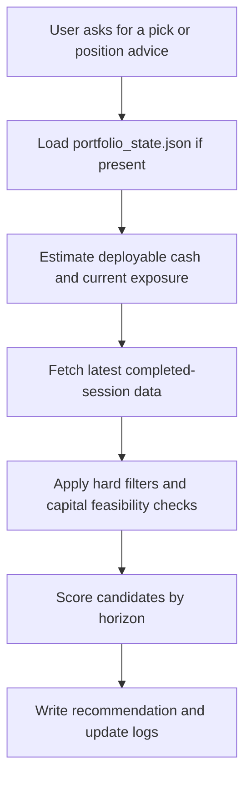

<div align="center">

# stock selection skills

Capital-aware A-share stock selection and position-management skill for Codex.

Designed for the post-close to pre-open window, with structure-based plans, capital feasibility checks, and persistent portfolio-state logging.

<p>
  
  
  
  
</p>

</div>

## What This Repo Contains

This repository packages the `a-share-stock-picker` skill into a clean, reusable open-source layout:

- `SKILL.md`: the skill contract and workflow
- `scripts/fetch_a_share_data.py`: Tonghuashun-first data fetcher with AkShare enrichment
- `scripts/backtest_short_term_rule.py`: quick validation for the short-term breakout rule
- `scripts/portfolio_state.py`: approximate capital, cash, and position-state tracker
- `references/`: lightweight domain rules for timing, hard filters, pricing, and portfolio management

## Highlights

- Capital-aware board-lot feasibility checks before recommending executable trades
- Persistent portfolio-state logging under `股票日志/portfolio_state.json`
- Short-term, medium-term, and long-term A-share workflows in one skill
- Tonghuashun machine-readable anchors, plus AkShare cross-checks when available
- Post-close structure handling that merges the just-finished session into the decision window
- Script-backed flow rather than prompt-only heuristics

## How It Works



## Repository Layout

```text
stock-selection-skills/
├─ SKILL.md
├─ agents/
│  └─ openai.yaml
├─ references/
│  ├─ capital-and-position-management.md
│  ├─ data-sources-and-window.md
│  ├─ horizon-selection-framework.md
│  ├─ output-template.md
│  ├─ price-plan-rules.md
│  ├─ short-term-backtest-workflow.md
│  ├─ trading-window-and-calendar.md
│  └─ universe-and-risk-filters.md
├─ scripts/
│  ├─ backtest_short_term_rule.py
│  ├─ fetch_a_share_data.py
│  ├─ portfolio_state.py
│  ├─ requirements.txt
│  └─ smoke_test.py
└─ .github/
   └─ workflows/
      └─ ci.yml
```

## Quick Start

### 1. Install dependencies

```powershell
python -m venv .venv
.venv\Scripts\python.exe -m pip install -r scripts\requirements.txt
```

### 2. Run the smoke test

```powershell
.venv\Scripts\python.exe scripts\smoke_test.py
```

### 3. Fetch one stock

```powershell
.venv\Scripts\python.exe scripts\fetch_a_share_data.py 000862 --days 120 --include-intraday --pretty
```

### 4. Initialize an approximate portfolio state

```powershell
.venv\Scripts\python.exe scripts\portfolio_state.py init --cash 3000 --as-of-date 2026-03-23 --overwrite
.venv\Scripts\python.exe scripts\portfolio_state.py buy 000862 --price 8.27 --budget 3000 --date 2026-03-23 --estimated
.venv\Scripts\python.exe scripts\portfolio_state.py show --refresh-prices
```

## Typical Use Cases

| Scenario | What the skill does |
|---|---|
| "I only have 3000 CNY" | Filters out names that are not realistically executable in one board lot |
| "I bought a stock full-position today" | Updates approximate holdings and prioritizes position management before new ideas |
| "Pick 3 short-term names for tomorrow" | Scores short-term candidates from the latest completed session and next-open context |
| "Write this into the stock log" | Writes Markdown trade notes and updates the persistent portfolio-state file |

## Design Notes

- The skill is optimized for after-close to before-next-open decision making.
- When the user explicitly asks only for short-term picks, the skill no longer pads medium-term and long-term output.
- If exact fill details are unknown, the state tracker stores them as estimates rather than pretending they are precise.
- The data fetcher now merges the just-finished session into the history window after the cash close, which is critical for next-day planning.

## Local Validation

This repository includes:

- a networked smoke test via `scripts/smoke_test.py`
- a deterministic local validation path for merge logic and portfolio-state CLI behavior
- a lightweight GitHub Action that validates imports, merge logic, and portfolio-state CLI behavior

## Disclaimer

This repository is for research workflow automation and skill packaging. It is not investment advice, not a broker integration, and not a guarantee of tradability or performance.
